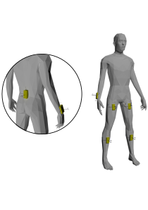

# Description

This repository is linked to the paper by A. Sawicki: Influence of accelerometer placement on biometric gait identification, which examines the impact of sensor location choice on the effectiveness of biometric identification systems. This paper uses the data set Luo Y., Coppola S., Dixon P., Li S., Dennerlein J., Hu B.: A database of human gait performance on irregular and uneven surfaces collected by wearable sensors.Sci. Data 2020,7, 2019 , and gait cycles were manually selected.

The purpose of the repository is to allow repetition of the experiment by providing the frames that start and end the gait.

# Dataset link
https://springernature.figshare.com/collections/A_database_of_human_gait_performance_on_irregular_and_uneven_surfaces_collected_by_wearable_sensors/4892463/1